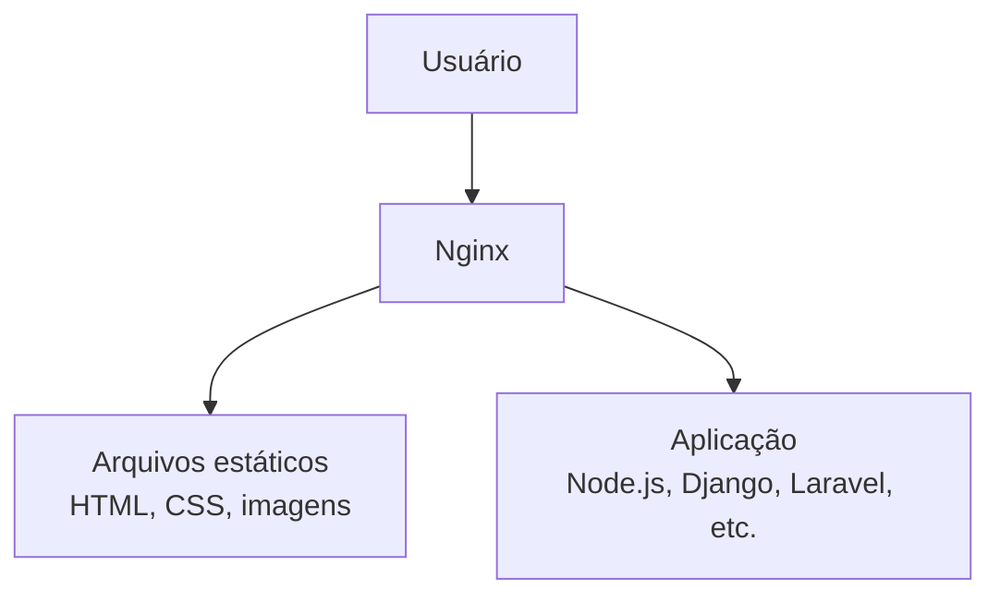
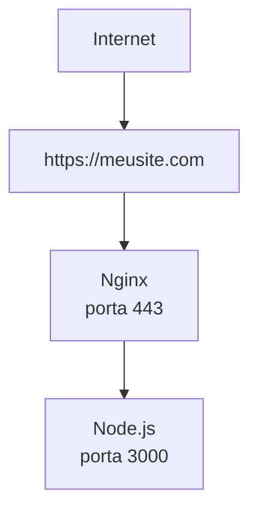

# `nginx`

O **Nginx** (pronuncia-se "engine-x") é um software de servidor web de alto desempenho, muito usado para hospedar sites, distribuir tráfego e melhorar a performance de aplicações.

Ele pode desempenhar várias funções:

* **Servidor web:** entrega arquivos estáticos, como HTML, CSS, JavaScript e imagens.
* **Proxy reverso:** recebe as requisições dos usuários e as encaminha para aplicações (como Node.js, Python, PHP, Java, etc.).
* **Balanceador de carga (Load Balancer):** distribui requisições entre vários servidores para melhorar desempenho e disponibilidade.
* **Proxy de cache:** armazena respostas em cache para reduzir o tempo de carregamento e o uso do servidor.
* **Gateway SSL/TLS:** gerencia certificados HTTPS e criptografa as conexões.

### Como ele funciona

Imagine que um usuário acessa um site:



Nesse cenário, o Nginx fica na "porta de entrada", recebendo todas as requisições.

### Exemplo prático

Se você tem uma aplicação em Node.js rodando na porta `3000`, o Nginx pode receber as conexões na porta `80` (HTTP) ou `443` (HTTPS) e encaminhá-las para a aplicação:




Assim, os usuários nunca acessam diretamente a aplicação.

### Vantagens

* Alto desempenho e baixo consumo de memória.
* Suporta milhares de conexões simultâneas.
* Facilita a configuração de HTTPS.
* Balanceamento de carga entre servidores.
* Cache para melhorar a velocidade.
* Muito utilizado em ambientes de produção e na nuvem.

### Exemplo de configuração

Um arquivo simples do Nginx para encaminhar requisições para uma aplicação:

```nginx
server {
    listen 80;
    server_name meusite.com;

    location / {
        proxy_pass http://localhost:3000;
    }
}
```

Nesse exemplo:

* O Nginx escuta na porta **80**.
* Toda requisição para `meusite.com` é encaminhada para a aplicação em `localhost:3000`.

### Quando você usa Nginx?

Você provavelmente usará Nginx se:

* Hospedar um site ou aplicação web.
* Colocar uma aplicação Node.js, Django, Flask, Laravel, Ruby on Rails ou Java em produção.
* Configurar HTTPS com certificados SSL/TLS.
* Distribuir carga entre múltiplos servidores.
* Servir arquivos estáticos de forma eficiente.

Em resumo, o **Nginx é uma das peças fundamentais da infraestrutura web moderna**, atuando como intermediário entre os usuários e as aplicações para fornecer desempenho, segurança e escalabilidade.

## Estrutura

```bash
tree
.
├── README.md
├── docker
│   ├── proxy
│   │   ├── app
│   │   │   ├── Dockerfile
│   │   │   ├── package.json
│   │   │   └── server.js
│   │   ├── docker-compose.yml
│   │   ├── nginx
│   │   │   └── nginx.conf
│   │   └── proxy.md
│   └── site
│       ├── http
│       │   ├── docker-compose.yml
│       │   ├── logs.md
│       │   ├── site
│       │   │   ├── index.html
│       │   │   ├── logo.png
│       │   │   ├── script.js
│       │   │   └── style.css
│       │   └── site.md
│       └── https
│           ├── certs
│           │   ├── site.crt
│           │   └── site.key
│           ├── docker-compose.yml
│           ├── https.md
│           ├── nginx
│           │   └── default.conf
│           └── site
│               ├── index.html
│               ├── logo.png
│               ├── script.js
│               └── style.css
└── k6
    └── script.js
```

## Utilização

- [Subindo um site com NGINX](./docker/site/http/site.md)
- [Subindo um projeto com Node.js e proxy reverso](./docker/proxy/proxy.md)
- [script de teste](./k6/script.js)