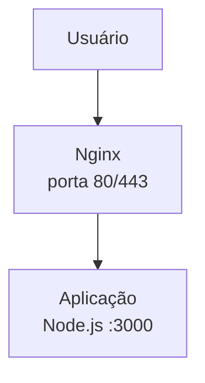
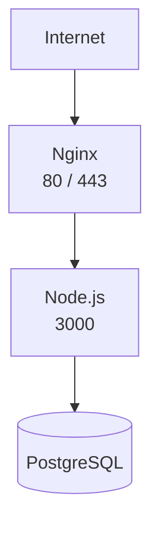

# `proxy reverso`

Uma forma muito comum de usar **Nginx + Docker** é colocar o Nginx como **proxy reverso** na frente da sua aplicação.

### Arquitetura



O usuário acessa:

```text
https://meusite.com
       ↓
Nginx
       ↓
Node.js:3000
```

## 1. Estrutura do projeto

Por exemplo:

```text
meu-projeto/
├── docker-compose.yml
├── nginx/
│   └── nginx.conf
└── app/
    ├── Dockerfile
    ├── package.json
    └── server.js
```

## 2. `docker-compose.yml`

```yaml
services:
  nginx:
    image: nginx:alpine
    ports:
      - "80:80"
    volumes:
      - ./nginx/nginx.conf:/etc/nginx/conf.d/default.conf:ro
    depends_on:
      - app

  app:
    build: ./app
    expose:
      - "3000"
```

Aqui temos dois containers:

* `nginx` → recebe as requisições na porta `80`
* `app` → executa o Node.js na porta `3000`

Um detalhe importante: **não precisamos publicar a porta 3000 para o computador**, porque o Nginx consegue acessar o container `app` diretamente pela rede interna do Docker.

## 3. Configuração do Nginx

Crie:

```text
nginx/nginx.conf
```

Com:

```nginx
server {
    listen 80;

    location / {
        proxy_pass http://app:3000;

        proxy_set_header Host $host;
        proxy_set_header X-Real-IP $remote_addr;
        proxy_set_header X-Forwarded-For $proxy_add_x_forwarded_for;
        proxy_set_header X-Forwarded-Proto $scheme;
    }
}
```

A parte mais importante é:

```nginx
proxy_pass http://app:3000;
```

Perceba que usamos **`app`**, e não `localhost`.

Dentro do container do Nginx:

```text
localhost:3000
```

significaria **o próprio container do Nginx**.

Já:

```text
app:3000
```

significa o container chamado `app` dentro da rede Docker.

## 4. Dockerfile da aplicação

Por exemplo:

```dockerfile
FROM node:22-alpine

WORKDIR /app

COPY package*.json ./
RUN npm install

COPY . .

EXPOSE 3000

CMD ["node", "server.js"]
```

E um `server.js` simples:

```javascript
const http = require("http");

const server = http.createServer((req, res) => {
    res.writeHead(200, {
        "Content-Type": "text/plain; charset=utf-8"
    });
    res.end("Olá! Node.js está funcionando através do Nginx!");
});

server.listen(3000, "0.0.0.0", () => {
    console.log("Servidor rodando na porta 3000");
});
```

O `0.0.0.0` é importante no Docker: permite que a aplicação aceite conexões vindas de fora do próprio processo/container.

O `package.json`

```json
{
  "name": "proxy-app",
  "version": "1.0.0",
  "description": "Aplicação Node.js atrás de Nginx",
  "main": "server.js",
  "scripts": {
    "start": "node server.js"
  }
}
```


## 5. Subir tudo

Na pasta do projeto:

```bash
docker compose up --build
```

Depois acesse:

```text
http://localhost
```

O caminho será:

```text
┌───────────┐
│  Browser  │
└─────┬─────┘
      │ :80
      ▼
┌───────────┐
│   Nginx   │
└─────┬─────┘
      │ :3000
      ▼
┌───────────┐
│  Node.js  │
└───────────┘
```

### E em produção?

Normalmente você evolui para algo assim:



O Nginx pode ficar responsável por **HTTPS, domínio, arquivos estáticos, proxy reverso e eventualmente balanceamento de carga**, enquanto a aplicação fica isolada no Docker.

Se você estiver começando agora, **Docker Compose + Nginx + Node.js** é uma ótima combinação para aprender containers e deploy.
