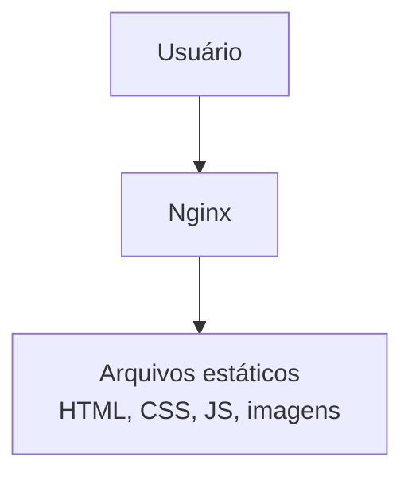
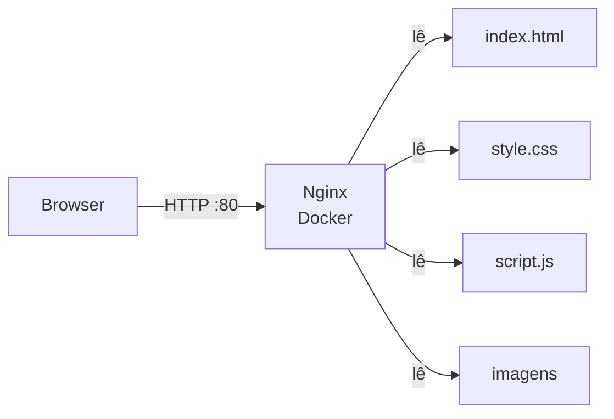

# `site estático`

Para um **site estático**, o Nginx fica ainda mais simples, porque você nem precisa de Node.js.

A arquitetura fica:



### Estrutura

```text
meu-site/
├── docker-compose.yml
└── site/
    ├── index.html
    ├── style.css
    └── script.js
```

### `docker-compose.yml`

```yaml
services:
  nginx:
    image: nginx:alpine
    ports:
      - "80:80"
    volumes:
      - ./site:/usr/share/nginx/html:ro
```

É só isso. O Nginx já vem configurado para procurar os arquivos em:

```text
/usr/share/nginx/html
```

E nós montamos nossa pasta:

```text
./site
```

nesse local.

### `index.html`

Por exemplo:

```html
<!DOCTYPE html>
<html lang="pt-BR">
<head>
    <meta charset="UTF-8">
    <title>Meu site</title>
    <link rel="stylesheet" href="style.css">
</head>
<body>
    <h1>Olá, mundo!</h1>
    <p>Meu site está rodando com Nginx e Docker.</p>
</body>
</html>
```

### Rodar

```bash
docker compose up -d
```

Depois abra:

```text
http://localhost
```

O fluxo será:



### E se quiser HTTPS?

Em produção, normalmente você coloca um domínio apontando para o servidor e configura o Nginx para:


Nesse caso, o Nginx também pode cuidar do **certificado TLS/HTTPS**.

**Resumo:** para um site estático, o Nginx basicamente é o servidor que pega `index.html`, CSS, JavaScript, imagens etc. do diretório e entrega esses arquivos ao navegador. Docker apenas empacota e executa esse Nginx de forma isolada.
